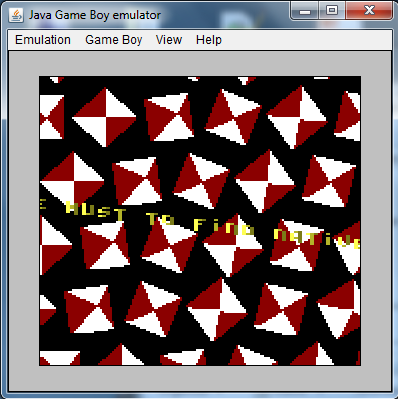
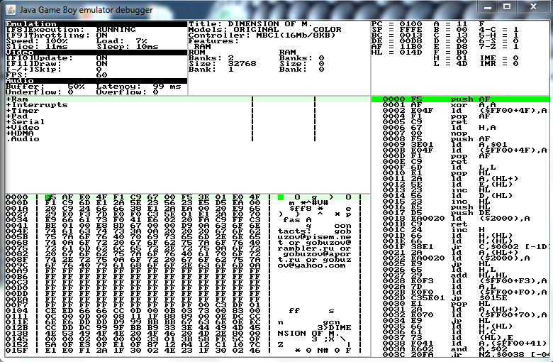

# GenDES

GenDES allows to easily, accurately and efficiently simulate any kind of event based phenomenon.

A full Game Boy emulator has been done and can be found in the [release](https://github.com/thenesis-org/gendes/releases) section.

GenDES provides generic debugging features which can be useful for game developpers and the emulation ecosystem.

Project page: http://gendes.thenesis.org 

### Requirements
- Java ME: CLDC/MIDP or CDC
- Java SE: Java 1.1 or newer

### Screenshots

